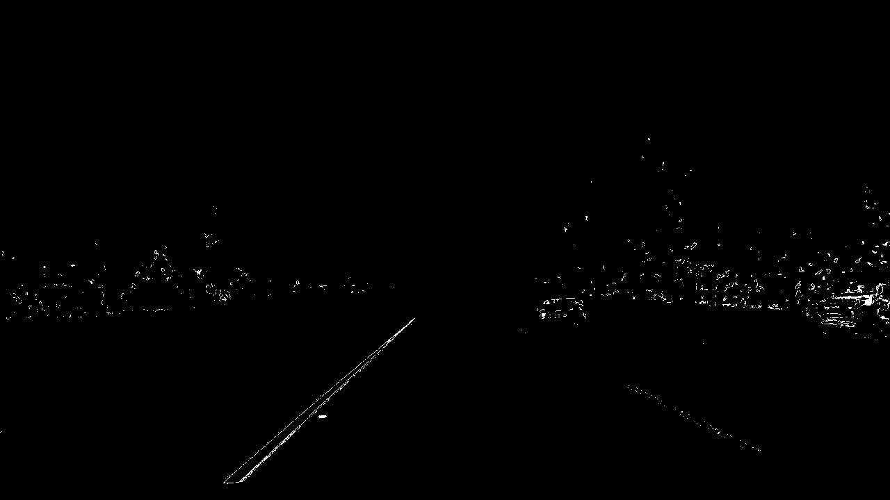
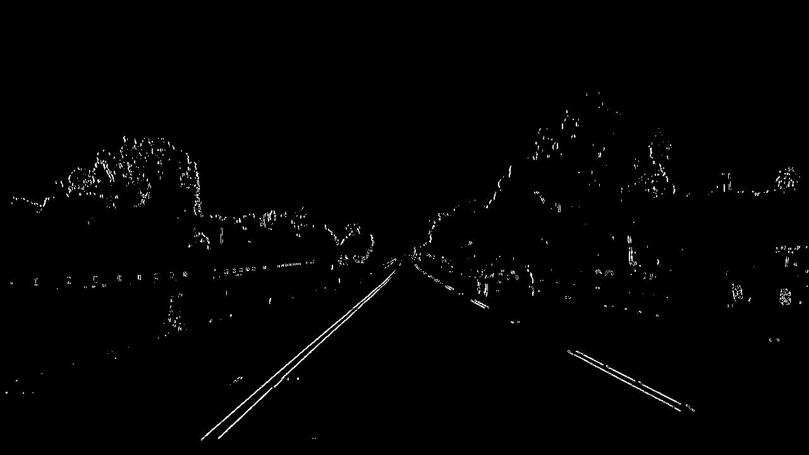

## Advanced Lane Finding
[](http://www.udacity.com/drive)


### The Project

The goals / steps of this project are the following:

* Compute the camera calibration matrix and distortion coefficients given a set of chessboard images.
* Apply a distortion correction to raw images.
* Use color transforms, gradients, etc., to create a thresholded binary image.
* Apply a perspective transform to rectify binary image ("birds-eye view").
* Detect lane pixels and fit to find the lane boundary.
* Determine the curvature of the lane and vehicle position with respect to center.
* Warp the detected lane boundaries back onto the original image.
* Output visual display of the lane boundaries and numerical estimation of lane curvature and vehicle position.


### Camera Calibration
In this step I calibrate the camera to remove any kind of distortion. Any real world camera has always some kind of distortion (Radial/Tangential) because camera are made up of lenses so they introduce some kind of distortion in the captured image. So with the help of openCV I correct the distortion. The common practice to correct for distortion is to take chess board images with different angles. Why chessboard images, because of high contrast between black and white boxes.

I start by preparing "object points", which will be the (x, y, z) coordinates of the chessboard corners in the world. Here I am assuming the chessboard is ficed on the (x,y) plane at (z=0), such that the object points are the same for each calibration image. Thus, `objp` is just a replicated array of coordinates, and `objpoints` will be appneded with a copy f it every time I successfully detect all chessboard corners in a test image. `imgpoints` will be appended with the (x,y) pixel position of each of the corners in the image plane with each successful chessboard detection.

I then used the output objpoints and imgpoints to compute the camera calibration and distortion coefficients using the cv2.calibrateCamera() function. I applied this distortion correction to the test image using the cv2.undistort() function and obtained this result:


### Pipeline (Single Images)
1. **Remove distortion from the image.**

2. **Creating threshold and binary images.**
	- I used the combination of color gradient thresholds to generate a binary image in `DetectLane.process_img()` method.
	- The main idea is to use S channel with have constant value irrespective of brightness.
	- And then use algo like sobelx and sobely to recognize different gradient along different axis.
	- And then combine both of the result.
	- Here is an example of the of my output for this step.
- **HLS - saturation filtering output**

- **Sobelx and Sobely gradient filtering**

- **Combined output of both**


3. **Perspective Transform**
	- In this step I change the prespective of the image so I could have a bird eye view of the lanes so I could fit a better curve through the lane lines.
	- The implementation of this step is in  `DetectLane.warp()` method.
    
    ```
    src = np.array([[(0.15*img.shape[1],img.shape[0]),(0.87*img.shape[1],img.shape[0]),
          (0.55*img.shape[1],img.shape[0]*0.63),(0.455*img.shape[1],img.shape[0]*0.63)]],
       np.int32)
       
    dst = np.array([[(0.15*img.shape[1],img.shape[0]),(0.87*img.shape[1],img.shape[0]),
                  (0.87*img.shape[1],0),(0.15*img.shape[1],0)]],
               np.int32)
    
    ```
	- Here is an example of the my output from this step.
    
 

    

4. **Fit a Curve through transformed lane line image.**
- Once we have transformed the image and have bird eye view of the lanes then we try to fit two curves for two lane lines.
- For doing this we take our two binary (with edge detetction with help of HSL channel and sobelx and sobely for detecting horizontal and vertical line respectively.
- The image is something like this.

- Then we sum all the pixels along `axis = 0` from middle of the height to the bottom of the image and by doing this we find two peaks which gives us two starting points.
- Once we find the starting point, then I decide about how many boxes or windows I will use in this image to find all the lane pixels.
- After that I divide height of image by number of boxes I will use so I got the height of box.
- And width in this project is 200 pixels.
- With the starting point I start to iterate over other boxes and I have decided on a threshold number pixels, If I get more than that number of pixels I will recalculate the mid point of the box and shift the center of the box accordingly and the threshold number in this implementation is `minpix = 100`.
- The idea is that once I do this for first frame then I will use this calculation to find all other pixel data in other frame using this same information. Like pixel data around the mid point around each box.
- Once I get all the data I fit a polynomial line through these data points with help of `np.polyfit(xlane,ylane,2)` and degree of polynomial is 2.
- And other thing which I have done in my implementation is, I have taken weighted average for lane lines weight. Something like this `newValue = newValue*0.4 + oldValue*0.6`.


## Discussion
The difficulty is to recognize the yellow and white lane lines at the same time under different lighting condition. When there is shadow casting on the lane, many pixels at the edges of the shadow are recognized as the part the lane line, because I have applied thresholding to gradients. I mitigate this by reducing the searching range in the polynomial fitting stage. There could be a more robust approach where some specific line detectors are established to distiguish the line from the shadow considering different lighting condition.


